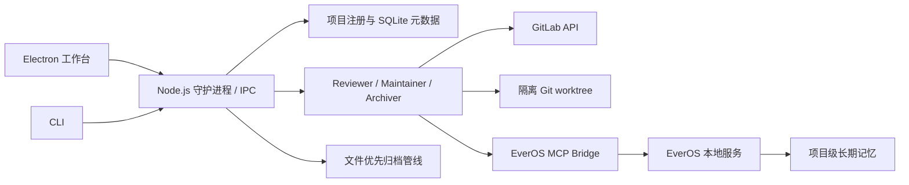

# CodeKeeper Advance

CodeKeeper Advance 是一个本地优先、面向多项目的 Agent 协作与知识智库系统。它通过长期运行的 Reviewer、Maintainer 与 Archiver 角色，将代码评审、问题维护、知识归档和长期记忆组织在同一套桌面工作台中。

> 当前版本为 `0.1.0`，处于 Alpha 阶段。建议先在测试项目或受保护分支中验证，再用于重要仓库。

## 核心能力

| 能力           | 说明                                                                                              |
| -------------- | ------------------------------------------------------------------------------------------------- |
| 多项目管理     | 注册多个本地项目，分别维护归档位置、GitLab 配置、角色开关与运行状态。                             |
| Reviewer       | 扫描 Merge Request，结合项目规则、变更内容和历史记忆生成结构化评审意见。                          |
| Maintainer     | 读取 Reviewer findings，检查问题是否仍然有效，在隔离 worktree 中尝试修复、验证并回复 discussion。 |
| Archiver       | 按文件优先的方式整理项目文档，支持归档、重组、忽略、标记和撤销。                                  |
| 长期记忆       | 使用 EverOS 保存项目知识、角色经验、案例与技能，并提供记忆图谱和统计视图。                        |
| 桌面工作台     | Electron + React 面板用于项目管理、角色配置、服务状态、日志、记忆图谱和归档历史查看。             |
| 守护进程与 CLI | Node.js 守护进程负责调度、IPC、模型服务和角色生命周期；CLI 提供注册、扫描、历史与撤销入口。       |

## EverOS 记忆系统

CodeKeeper Advance 的长期记忆能力采用 **EverOS**，源码以 Git submodule 方式放在 `vendor/everos`。

- EverOS 作为本地 sidecar 服务运行，主进程通过 HTTP 与 MCP 桥接访问记忆能力。
- 首次启动角色服务时，系统会在用户目录创建独立 Python 虚拟环境，并从 submodule 安装 EverOS。
- 记忆默认按项目组织；Reviewer、Maintainer、Archiver 等角色记忆挂载在对应项目节点下。
- 只有适合跨项目复用的共性知识才应进入系统级记忆，避免不同项目的上下文互相污染。
- 本地 Embedding 与 Rerank 模型用于记忆检索；首次使用时可能需要下载模型文件。
- EverOS 数据默认保存在本机。若启用了远程大语言模型或多模态模型，相关工作流仍可能把必要上下文发送到所配置的服务端。

EverOS 不受本仓库 MIT License 的重新许可约束。本项目不主张拥有 EverOS 的版权、商标或其他权利；CodeKeeper Advance 依据 Apache License 2.0 使用 `vendor/everos`，并在遵守该许可证及其 NOTICE 要求的前提下使用、修改和重新分发该组件。完整边界见 [许可证与权利边界](#许可证与权利边界) 与 `THIRD_PARTY_NOTICES.md`。

## 架构概览



## 环境要求

- Node.js `>= 22`
- npm
- Python `>= 3.12`，并提供 `venv` 与 `pip`
- Git
- 可访问所配置模型服务的网络环境
- 使用 MR 角色时，需要 GitLab 项目访问权限和具备相应操作权限的 Token

当前主要在 Windows 环境中开发和验证。代码包含跨平台路径处理，但 Linux 与 macOS 的完整桌面流程仍建议自行验证。

## 快速开始

### 1. 获取源码与 submodule

```bash
git clone --recurse-submodules YOUR_REPOSITORY_URL
cd codekeeper-advance
```

如果已经克隆了仓库，请补充初始化 EverOS：

```bash
git submodule update --init --recursive
```

### 2. 安装依赖

```bash
npm install
```

### 3. 启动完整开发环境

```bash
npm run electron:dev:all
```

该命令会构建后端并同时启动守护进程、Vite、Electron TypeScript watch 和桌面窗口。首次启用角色服务时，EverOS 虚拟环境初始化和本地模型下载可能需要一些时间。

### 4. 完成界面配置

1. 在“设置”中配置 Agent 使用的大语言模型。
2. 选择本地 Embedding 与 Rerank 模型；需要时再配置 EverOS 多模态模型。
3. 在“仪表盘”注册本地项目，并按需指定独立归档位置。
4. 在角色页面填写 GitLab 项目地址、Token、筛选条件和角色参数。
5. 先在测试项目中启用角色并观察日志，确认行为符合预期后再扩大范围。

## 配置说明

### 应用级配置

桌面设置会写入：

```text
~/.codekeeper-advance/daemon-config.json
```

主要配置包括：

- Agent LLM 的 Provider、API Key、Base URL、Model 与自定义 Headers
- 扫描周期和每分钟请求限制
- 本地 Embedding / Rerank 模型
- EverOS 多模态模型覆盖配置

当前 Advance 主流程以桌面设置和 `daemon-config.json` 为准。根目录的 `.env.example` 用于兼容入口，不应作为桌面主流程的唯一配置来源。

### 项目级配置

项目注册信息、GitLab 配置和角色配置保存在本地元数据数据库中。文档扫描规则默认从以下文件读取：

```text
<project>/.codekeeper/config.yaml
```

示例：

```yaml
name: example-project
include:
  - '**/*.md'
  - '**/*.yaml'
exclude:
  - 'node_modules/**'
  - '.git/**'
  - 'dist/**'
categories:
  - architecture
  - operations
docTypes:
  - guide
  - decision
```

未指定归档位置时，归档内容默认写入项目内的 `.codekeeper`；也可以在注册项目时选择仓库外的独立目录。

## CLI

开发模式下可以通过 `npm run dev --` 调用 CLI：

```bash
npm run dev -- register /path/to/project
npm run dev -- list
npm run dev -- status
```

| 命令                                              | 用途                           |
| ------------------------------------------------- | ------------------------------ |
| `register <project-path> [--archive-root <path>]` | 注册项目和可选归档位置。       |
| `unregister <project-id>`                         | 注销项目。                     |
| `list`                                            | 列出已注册项目。               |
| `start [--api-key <key>]`                         | 启动守护进程。                 |
| `process <project-path> --api-key <key>`          | 对已注册项目执行一次归档流程。 |
| `status`                                          | 查看项目与待处理事件状态。     |
| `history <project-path>`                          | 查看归档动作历史。             |
| `undo <action-id> <project-path>`                 | 撤销指定归档动作。             |

构建后也可以使用：

```bash
npm run build
npm start
```

如果执行 `npm link`，包会提供 `codekeeper` 命令。角色与 GitLab 的完整配置目前仍推荐通过 Electron 工作台完成。

## 本地数据目录

| 路径                                     | 内容                                       |
| ---------------------------------------- | ------------------------------------------ |
| `~/.codekeeper-advance/`                 | 守护进程配置、SQLite 元数据和 IPC 文件。   |
| `~/.codekeeper/everos-venv/`             | 自动创建的 EverOS Python 虚拟环境。        |
| `~/.codekeeper/everos-data/`             | EverOS 配置与长期记忆数据。                |
| `~/.codekeeper/memory/`                  | 项目角色状态、Soul 与辅助记忆文件。        |
| `<project>/.codekeeper/`                 | 默认项目配置与归档输出，可配置为外部目录。 |
| `<project-parent>/.codekeeper-worktree/` | Maintainer 使用的隔离 worktree。           |
| `~/Logs/codekeeper/`                     | 应用与角色运行日志。                       |

## 常用开发命令

| 命令                       | 说明                                                |
| -------------------------- | --------------------------------------------------- |
| `npm run build`            | 编译 TypeScript，并复制 schema 与 prompts。         |
| `npm run electron:dev:all` | 启动完整桌面开发环境。                              |
| `npm run electron:build`   | 构建 Electron renderer 与 main/preload TypeScript。 |
| `npm test`                 | 运行项目测试入口。                                  |
| `npm run test:vitest`      | 直接运行 Vitest。                                   |
| `npm run lint`             | 检查 `src` 下的 TypeScript。                        |
| `npm run format`           | 检查 Prettier 格式。                                |

当前仓库尚未提供正式安装包发布流程，`electron:build` 仅生成构建产物，不会创建平台安装程序。

## 安全与隐私

- API Key 与 GitLab Token 当前保存在本地配置文件或 SQLite 元数据中，请保护用户目录权限，不要提交或分享这些文件。
- Maintainer 具备修改代码、执行验证和与远端分支交互的能力。请使用最小权限 Token，并先在受控项目中验证自动修复策略。
- 项目规则、MR 内容、代码片段和记忆召回结果可能进入所配置的远程模型上下文，请根据组织的数据策略选择模型服务。
- EverOS 服务和记忆数据默认在本机运行，但“本地记忆”不等于整个 Agent 工作流完全离线。
- 新增测试应使用临时目录、fixture 或虚拟仓库，避免写入开发者机器上的真实项目路径。

## 当前限制

- 当前 MR Provider 主要面向 GitLab。
- 桌面应用仍以源码方式运行，尚未提供签名安装包。
- 凭据尚未接入操作系统安全存储。
- 跨平台桌面流程和长时间运行稳定性仍需要更多公开环境验证。

## 贡献

欢迎通过 Issue 或 Pull Request 提交问题、设计建议与改进。提交前建议至少执行：

```bash
npm run build
npm run test:vitest
npm run lint
npm run format
```

请勿提交真实 Token、用户目录、私有项目路径、模型缓存、运行日志或 EverOS 本地数据。

## 许可证与权利边界

- `LICENSE` 中的 MIT License 仅适用于 CodeKeeper Advance 项目原创、且项目有权授权的代码、文档和其他材料；它不覆盖 `vendor/everos`、第三方依赖、数据集 fixture 或其他另有标注的内容。
- CodeKeeper Advance 自有材料的版权声明为 `Copyright © 2026 SobertLi`。该声明不改变任何第三方组件的版权、商标或其他权利归属，也不代表本项目拥有 EverOS。
- EverOS 位于 `vendor/everos`，继续使用其 Apache License 2.0。该许可证在满足其条件的范围内允许使用、修改、制作衍生作品和重新分发；分发时必须保留其 `LICENSE`、`NOTICE` 及适用的版权声明，且 Apache License 2.0 不授予 EverOS 商标使用权。
- EverOS 上游发行内容还包含单独许可的测试 fixture，以及可选依赖的许可说明；重新分发前请阅读 `THIRD_PARTY_NOTICES.md` 和 submodule 内的 `NOTICE`。
- npm、Python 与模型依赖继续受各自许可证和使用条款约束。

本项目不对第三方组件的权利链作超出其许可证文本的承诺。若发布包含 fork、定制提交或完整依赖集合的二进制包、容器镜像或源码归档，应在发布前核验对应提交的来源、贡献者授权和再分发条件，并生成与实际发布物一致的第三方许可证清单。

Copyright © 2026 SobertLi
